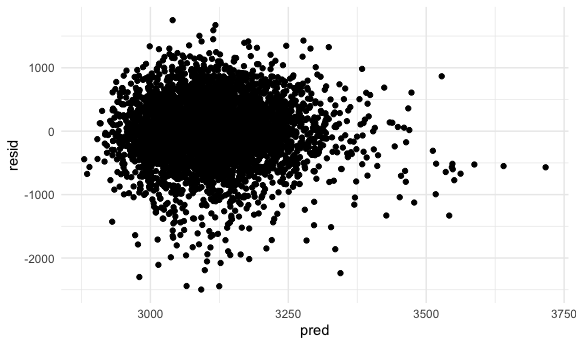
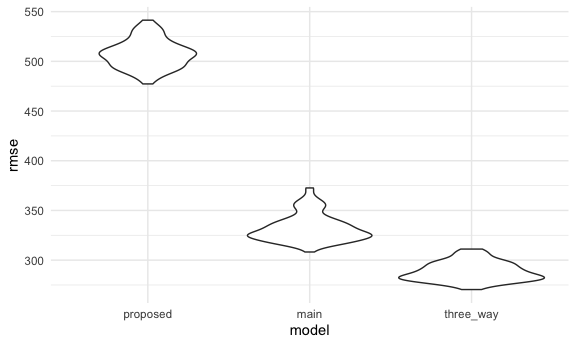

Homework 6
================
Tu Nguyen

This is my solution to HW6.

## Problem 2

Load and clean birth weight dataset

``` r
birthweight_df = 
  read.csv("./data/birthweight.csv") %>% 
  mutate(
    babysex = as.factor(babysex),
    frace = as.factor(frace),
    malform = as.factor(malform),
    mrace = as.factor(mrace)
  )
```

From my knowledge, the mother’s age and pre-pregnancy BMI can be the
determinants of the baby’s birth weight. I am interested in
investigating the relationship between the mother’s physique at delivery
+ the baby’s gender and baby’s birth weight.

``` r
proposed_model = lm(bwt ~ babysex + momage + ppbmi, data = birthweight_df)
```

Plot of model residuals against fitted values

``` r
birthweight_df %>% 
  add_predictions(proposed_model) %>% 
  add_residuals(proposed_model) %>% 
  ggplot(aes(x = pred, y = resid)) + 
  geom_point()
```



Automate the CV process

``` r
cv_df = 
  crossv_mc(birthweight_df, 100)
```

Compare my model to two others

``` r
cv_df = 
  cv_df %>% 
  mutate(
    proposed_mod = map(train, ~lm(bwt ~ babysex + momage + ppbmi, data = .x)),
    main_mod = map(train, ~lm(bwt ~ blength + gaweeks, data = .x)),
    three_way_mod = map(train, ~lm(bwt ~ bhead + blength + babysex + bhead*blength + blength*babysex + bhead*babysex + bhead*blength*babysex, data = .x))
  ) %>% 
  mutate(
    rmse_proposed = map2_dbl(proposed_mod, test, ~rmse(model = .x, data = .y)),
    rmse_main = map2_dbl(main_mod, test, ~rmse(model = .x, data = .y)),
    rmse_three_way = map2_dbl(three_way_mod, test, ~rmse(model = .x, data = .y))
  )
```

Make comparison in terms of the cross-validated prediction error

``` r
cv_df %>% 
  select(starts_with("rmse")) %>% 
  pivot_longer(
    everything(),
    names_to = "model",
    values_to = "rmse",
    names_prefix = "rmse_"
  ) %>% 
  mutate(model = fct_inorder(model)) %>% 
  ggplot(aes(x = model, y = rmse)) + 
  geom_violin()
```



The proposed model has the highest prediction error. Model with the head
circumference, length, sex, and all interactions (including the
three-way interaction) has the lowest prediction error.

## Problem 3

Download dataset

``` r
weather_df = 
  rnoaa::meteo_pull_monitors(
    c("USW00094728"),
    var = c("PRCP", "TMIN", "TMAX"), 
    date_min = "2017-01-01",
    date_max = "2017-12-31") %>%
  mutate(
    name = recode(id, USW00094728 = "CentralPark_NY"),
    tmin = tmin / 10,
    tmax = tmax / 10) %>%
  select(name, id, everything())
```

    ## Registered S3 method overwritten by 'hoardr':
    ##   method           from
    ##   print.cache_info httr

    ## using cached file: /Users/tunguyen/Library/Caches/R/noaa_ghcnd/USW00094728.dly

    ## date created (size, mb): 2020-10-04 23:54:44 (7.522)

    ## file min/max dates: 1869-01-01 / 2020-10-31
